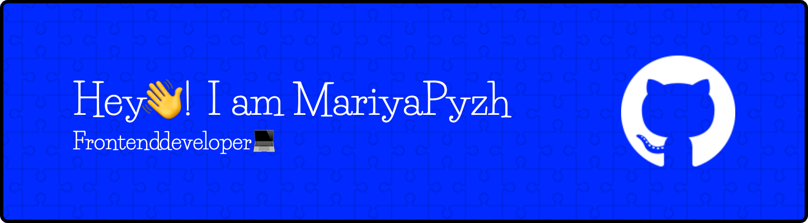

## **About me:**

📍 I'm from Belarus, Minsk.

🎓 I graduated from RSSchool, where I significantly expanded my portfolio and gained experience working in a team.

👀 I never stop learning.

## **Connect with me:**

## **Languages and Tools:**

  
  
  
  
  
  
  
  
  
  
  
  
  
  
  
  
  
  
  
  
  
  
  

## **Projects:**

### "Mineweeper"
Implementation of the classic game "Mineweeper". Statistics are displayed, the configuration and progress of the game can be saved, and the difficulty of the game can be selected.

<a href="https://github.com/maria-kashpur/minesweeper" target="_blank">
 github
</a> 
<a href="https://maria-kashpur.github.io/minesweeper/" target="_blank">
 deploy
</a>

### "Virtual keyboard"
The virtual keyboard allows users to enter text using either a mouse or a physical keyboard. Implemented switching layout and language, saving the language after reloading the page, and keystroke animation.

<a href="https://github.com/maria-kashpur/virtual-keyboard" target="_blank">
 github
</a> 
<a href="https://maria-kashpur.github.io/virtual-keyboard/" target="_blank">
 deploy
</a>

### Application for GraphQL queries
The application that allows to send requests to a user-specified GraphQL endpoint. Implemented authorization with form validation on the client side, request formatting, and code highlighting, changing the theme and language. The project was completed by a team of 3 people.

<a href="https://github.com/maria-kashpur/graphiql-app" target="_blank">
 github
</a> 
<a href="https://codehub-graphiql-app.netlify.app/" target="_blank">
 deploy
</a>

### CSS Selector Trainer
The interactive trainer designed to help you learn CSS selectors. The project includes several game levels, each of which represents HTML layout and a task for writing the corresponding CSS selector.

<a href="https://github.com/maria-kashpur/rs-css" target="_blank">
 github
</a> 
<a href="https://maria-kashpur.github.io/rs-css/" target="_blank">
 deploy
</a>

### Shelter
Multi-page website for a pet shelter. Pixel perfect layout.

<a href="https://github.com/maria-kashpur/shelter" target="_blank">
 github
</a> 
<a href="https://maria-kashpur.github.io/shelter/index.html" target="_blank">
 deploy
</a>

### Async Race
The project is a virtual racing competition between cars.

<a href="https://github.com/maria-kashpur/async-race" target="_blank">
 github
</a>

## **Codewars:**

##

