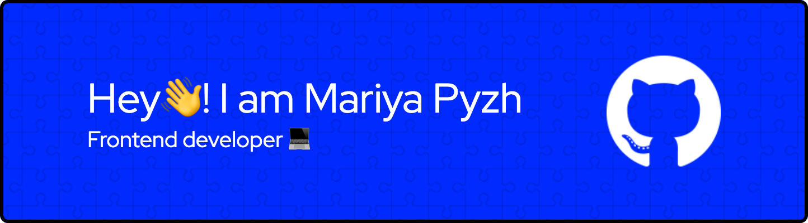

## **About me:**

📍 I'm from Belarus, Minsk.

🎓 I graduated from RSSchool, where I significantly expanded my portfolio and gained experience working in a team.

👀 I never stop learning.

## **Connect with me:**

## **Languages and Tools:**

  
  
  
  
  
  
  
  
  
  
  
  
  
  
  
  
  
  
  
  
  
  
  

## **Projects:**

You can see my projects and additional information about me in my <a href="https://maria-kashpur.github.io/minesweeper/" target="_blank">
 cv.
</a>

##

